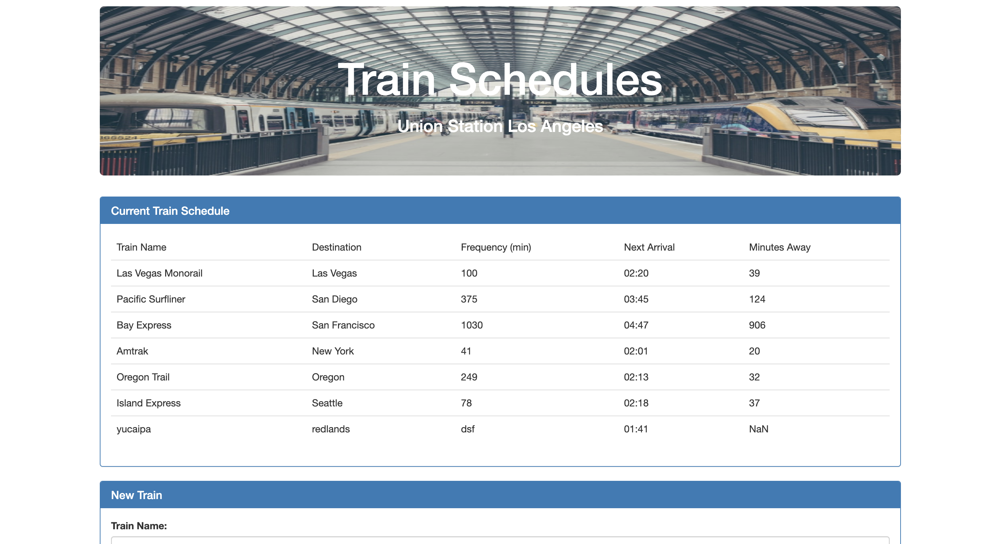

# Train-Scheduler

Firebase - Train Scheduler 

Instructions:
1. When adding trains, administrators should be able to submit the following:
    - Train Name
    - Destination
    - First Train Time -- in military time
    - Frequency -- in minutes
2. This app to calcuate when the next train will be arrive
3. Users from may different machines must be able to vew same train times.
4. Enjoy!
